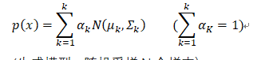
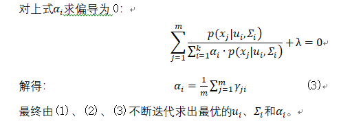

## 高斯混合聚类

**摘要： 本文介绍了高斯混合聚类模型。从高斯混合聚类的原理入手，通过流程图和伪代码讲解了高斯混合聚类的迭代计算均值向量，协方差矩阵和混合系数的过程，并采用多种数据集进行验证，最后将高斯混合聚类模型和其他聚类算法进行了对比。**

**关键词：聚类，高斯混合，迭代**

# 1.初识高斯混合聚类

①从几何角度来看：多个高斯分布加权求平均、叠加形成的

​         

②从混合模型角度来看：(生成模型：随机采样N个样本）

# 2.高斯混合聚类相应计算

若  服从高斯分布，其概率密度函数为：

 

则高斯混合分布：

 

假设样本的采样是由掷骰子，显然的先验概率    ，根据贝叶斯定理，  的后验分布为：

 

  给出了样本  第  个高斯混合成分生成的后验概率，简记为  (  =1,2,…,   )。当高斯混合分布已知时，高斯混合聚类把样本集D划分为  个簇，每个样本  的簇标记 


 

# 3.极大似然法求解过程




# 4.高斯混合聚类流程图

 

# 5.伪代码介绍


# 6.模型检测


# 7.高斯混合聚类算法实现

333.py为最终完成文件，444.py为，高斯混合聚类与其他聚类算法的对比


# 8.模型评价与对比

##       8.1西瓜4下不同聚类个数

​    


  根据上述数据，对于西瓜4数据集来说，聚成四类的DBI比聚成三类的DBI要低，所以西瓜4数据集聚成4类好过聚成3类。

## 8.2iris下不同聚类个数


 

 根据上述数据，对于iris数据集来说，聚成四类的DBI比聚成三类的DBI要低，所以iris数据集聚成4类好过聚成3类。

## 8.3西瓜4下高斯混合，K-means，层次聚类对比

 

高斯混合聚类： 


Kemans聚类：


 

 

层次聚类：

 

8.4iris下高斯混合，K-means，层次聚类对比

高斯混合；

 


Kmeans：

 

层次聚类：  

 

# 9.感想

我们通过阅读书籍和查找资料完成了高斯混合聚类模型的编写，但是也然存在着问题，比如与成熟的第三方库进行对比，我们的手写代码运行效率较为低下，时间差距甚至超过了10倍，在查阅资料的时候也发现不少同学有这种问题，接下来我们会继续优化手写代码，争取减小时间消耗。

 

 

# 10.参考文献

[1]周志华. 机器学习. 北京：清华大学出版社，2016

[2] 机器学习评价指标大汇总，https://zhaokv.com/machine_learning/2016/03/ml-metric.html

[3] 如何用高斯混合模型 GMM 做聚类，https://www.jianshu.com/p/2ce2102c9620

[4] 机器学习-聚类(混合高斯算法)，https://blog.csdn.net/lyn5284767/article/details/81358611

 

 

# 11.附录

```python
#最初编写的时候没考虑会给别人看，写法太幼稚了，见笑了

import numpy as np

import random 

\#添加计算DBI，画图修改为画[1,2,3,4,5,6,7,8,9,10,11,12,13,14,15,16,17,18,19,20,21,22,23,24,25,26,27,28,29,30]次迭代后的散点图

def gai_lv_mi_du(x,u,s):#1.计算概率密度，供后验概率计算使用。①。

  n=len(x)

  p=[]

  \#p=(1/((2*3.1415926)**(n/2)*(np.linalg.det(s))**(1/2)))*np.exp((-1/2)*np.dot(np.dot((x-u),np.linalg.inv(s)),np.transpose(x-u)))

  p=(1/((2*3.1415926)**(n/2)*(np.linalg.det(s))**(1/2)))*np.exp((-1/2)*np.dot(np.dot((x-u),np.linalg.inv(s)),np.array(x-u).reshape(len(x-u),1)))

  return p

 

def hou_yan_gai_lv(j,i):#2.输入j,i计算r_ji,即第j个样本关于第i个成分的后验概率。②

  fenzi=a[i-1]*gai_lv_mi_du(data[j-1,:],u[i-1],s[i-1])#计算分子

  fenmu=0

  for i in range(k):

​    fenmu=fenmu+a[i]*gai_lv_mi_du(data[j-1],u[i],s[i])#计算分母 

  r=fenzi/fenmu#分子/分母获得r_ji的后验概率

  return r

 

def jun_zhi_xiang_liang(x):#4.计算新的均值向量。输入x即计算第x个均值向量

​    fenzi=0

​    fenmu=0

​    for i in range(data.shape[0]):

​        fenzi=fenzi+r[i][x-1]*data[i,:]

​    for i in range(data.shape[0]):

​        fenmu=fenmu+r[i][x-1]    

​    z=fenzi/fenmu

​    return z

 

def xie_fang_cha_jv_zhen(x):#6.计算新的协方差矩阵。输入x即计算第x个协方差矩阵

​    fenzi=0

​    fenmu=0

​    for i in range(data.shape[0]):

​        fenzi=fenzi+r[i][x-1]*(data[i,:]-u[x-1])*np.array(data[i,:]-u[x-1]).reshape(len(data[i,:]-u[x-1]),1)

​        

​    for i in range(data.shape[0]):

​        fenmu=fenmu+r[i][x-1]

​    z=fenzi/fenmu

​    return z

 

 

def hun_he_xi_shu(x):#8.计算混合系数。

​    fenzi=0

​    fenmu=0

​    for i in range(data.shape[0]):

​        fenzi=fenzi+r[i][x-1]

​    fenmu=data.shape[0]

​    z=fenzi/fenmu

​    return z

 

 

 

\#data = np.loadtxt("watermelon4.txt")

data = np.loadtxt("iris.txt")

print(data)

\#0.初始化

\#k个高斯分布

k=4

\#初始权重

a=[1/k for x in range(k)]

\#print(a)

\#初始均值向量

u=[data[random.randint(0,data.shape[0]-1),:] for x in range(k)]

\#u=[data[5,:],data[13,:],data[22,:]]

\#u=[data[7,:],data[27,:],data[37,:],data[47,:]]

 

\#初始协方差矩阵

\#s= [np.array([[0.1, 0], [0, 0.1]]) for x in range(k)]

s= [np.array([[0.1,0,0,0], [0,0.1,0,0], [0,0,0.1,0], [0,0,0,0.1]]) for x in range(k)]

\#迭代次数

yyy=[1,2,3,4,5,6,7,8,9,10,11,12,13,14,15,16,17,18,19,20,21,22,23,24,25,26,27,28,29,30]

for i_1 in range(len(yyy)):

​    gggg=yyy[i_1]

​    for h in range(gggg):

​        \#3.计算后验概率,将数据放入r矩阵中，获得一个r_ji的一个j*i大小的矩阵。

​        x=data.shape[0]#样本个数

​        y=data.shape[1]#样本维数

​        r=np.zeros(shape=(x,k))

​        \#print(r.shape)

​        \#print(x,y)

​        \#print(r)

​        for j in range(x):

​            for i in range(k):

​                r[j][i]=hou_yan_gai_lv(j+1,i+1)

​        \#print(r)

​        \#print(gai_lv_mi_du_jv_zhen())

 

​        \#5.更新均值向量。

​        for i in range(len(u)):

​            u[i]=jun_zhi_xiang_liang(i+1)

​        \#print(u)

 

​        \#7.更新协方差矩阵列表。

​        for i in range(len(s)):

​            s[i]=xie_fang_cha_jv_zhen(i+1)

​        \#print(s)

​        

​        \#9.更新混合系数列表。

​        for i in range(len(a)):

​            a[i]=hun_he_xi_shu(i+1)

​    

 

​    \#print(a)

​    \#print(u)

​    \#print(s)

​    \#print(r)

 

​    \#计算属于哪一类。并将结果存入(j,1)大小的矩阵中

​    jv_lei_jie_guo=np.zeros(shape=(data.shape[0],1))

 

​    for ii_2 in range(data.shape[0]):

​        jv_lei_jie_guo[ii_2]=r[ii_2].tolist().index(max(r[ii_2]))+1

​    \#print(jv_lei_jie_guo)

 

 

​    \#将data和分类结果合并

​    zui_zhong_jie_guo=np.c_[data,jv_lei_jie_guo]

​    \#print(zui_zhong_jie_guo)

​    \#将合并后按最后一行排序

​    a_arg =zui_zhong_jie_guo[np.lexsort(zui_zhong_jie_guo.T)]

​    \#print(a_arg)

 

​    \#创建不同簇

​    cu_1=np.zeros((1,a_arg.shape[1]))

​    cu_2=np.zeros((1,a_arg.shape[1]))

​    cu_3=np.zeros((1,a_arg.shape[1]))

​    cu_4=np.zeros((1,a_arg.shape[1]))

​    cu_5=np.zeros((1,a_arg.shape[1]))

​    \#print(cu_1)

​    \#将样本分别放入不同簇中

​    for jjj in range(data.shape[0]):

​        if a_arg[jjj][-1]==1:

​            cu_1=np.vstack((cu_1,a_arg[jjj]))

​        elif a_arg[jjj][-1]==2:

​            cu_2=np.vstack((cu_2,a_arg[jjj]))

​        elif a_arg[jjj][-1]==3:

​            cu_3=np.vstack((cu_3,a_arg[jjj]))

​        elif a_arg[jjj][-1]==4:

​            cu_4=np.vstack((cu_4,a_arg[jjj]))       

​        else :

​            cu_5=np.vstack((cu_5,a_arg[jjj]))   

​    \#因为采用与单行零矩阵拼接而成，所以每个矩阵去掉第一行并去掉类别标签

​    cu_1=np.delete(cu_1[1:],-1,1)

​    cu_2=np.delete(cu_2[1:],-1,1)

​    cu_3=np.delete(cu_3[1:],-1,1)

​    cu_4=np.delete(cu_4[1:],-1,1)

​    cu_5=np.delete(cu_5[1:],-1,1)

​    cu=[cu_1,cu_2,cu_3,cu_4,cu_5]

   

​    \#print(cu)

​    \#计算簇内曼哈顿距离

​    def dist(xx):

​        xxx=0

​        for iiii in range(xx.shape[0]):

​            if iiii+1<xx.shape[0]:

​                xxx=xxx+abs((xx[iiii+1]-xx[iiii]))

​            else:

​                break

​        xxx=xxx.sum(0)

​        return xxx

​    \#print(dist(cu_1))

​    \#计算簇中样本间平均距离

​    def avg(xx):

​        aaa=0

​        aaa=dist(xx)*(2/(k*(k-1)))

​        return aaa

​    \#print(avg(cu_1))

 

​    \#计算两簇间中心点距离

​    def dcen(xx,yy):

​        aaa=(xx.sum(0))/(xx.shape[0])#计算簇中向量相加

​        bbb=(yy.sum(0))/(yy.shape[0])#计算簇中向量相加   

​        ccc=abs(aaa-bbb).sum()

​        return ccc

​    \#计算DBI指数

​    def DBI():

​        for iii in range(k):

​            ddd=((avg(cu[iii])+avg(cu[iii+1]))/dcen(cu[iii],cu[iii+1]))/k

​            ddd=abs(ddd)

​            

​            return ddd

​    print(DBI())

​    import matplotlib.pyplot as plt

​    \#plt.ylim(0,1)

​    plt.plot(gggg,DBI(),'ro','w')

​    \# plt.xlabel("x")

​    \# plt.ylabel("y")

plt.show()

 
print(jv_lei_jie_guo)

 
```


